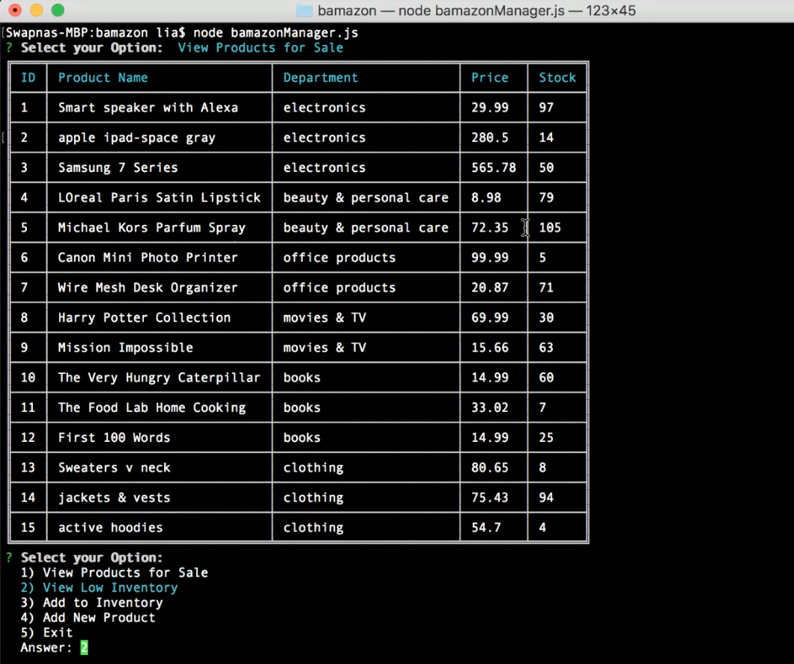

# bamazon

### Overview
---
Amazon-like storefront with MySQL.

### Getting Started
---
* Clone down repo ``` git clone git@github.com:liaswapna/bamazon.git```.
* Navigate to the repo ```cd bamazon```.
* Create .env file ```touch .env``` with database details.
  ``` 
      DB_USER = Your_User_Name
      DB_PASSWORD = Your_Password
  ```
* Run command ```npm install``` in Terminal or GitBash
* Run command ```node bamazonCustomer``` for Manager View.
* Run command ```node bamazonManager``` for Customer View.
* Run command ```node bamazonSupervisor``` for Supervisor View.

### Technologies Used
---
* Node js
* MySQL

### Dependencies
---
```js
{
    "cli-table": "^0.3.1",
    "colors": "^1.3.3",
    "dotenv": "^6.2.0",
    "express": "^4.16.4",
    "inquirer": "^6.2.1",
    "mysql": "^2.16.0"
}
```
### Code Explanation
---
#### Roles and Actions

* bamazonCustomer
    * View Products for Sale
    * Purchase product

* bamazonManager
    * View Products for Sale
    * View Low Inventory
    * Add to Inventory
    * Add New Product

* bamazonSupervisor
    * View Departments
    * View Product Sales by Department
    * Create New Department

### Demos
---
* customer view
    * [Demo Link](https://drive.google.com/file/d/1sfHh_Xpy8NZrH33jkEApgwRMfFS2DY9E/view)

* Manager View
    * [Demo Link](https://drive.google.com/file/d/1uC6LkDol39efRUeGAgrRjVJVRAitLJGS/view)
    
* Supervisor View
    * [Demo Link](https://drive.google.com/file/d/1aGPxZtw7ZgRDAiLObHlJEAGUUkvbBPsk/view)

### Screeshots
---
#### Customer View
* Run command ```node bamazonCustomer.js``` in the command line to start the Customer View. It displays details of products for sale and prompt the customer to order desired product.


*   The customer specifies the product's ID and quantity they like to order. The app displays the order's total price if order is carried out successfully.


*   The app displays Insufficient quantity if there isn't enough quantity to place the order.


#### Manager View
---

* Run command ```node bamazonManager.js``` in the command line to start the Manager View. It displays set of option in which the manager can operate on.


* Option1 displays the products for sales. 


* Option2 displays the Low Inventory.
  Option3 helps the manager to add to the Inventory. Option4 helps to add new product to the database.


* Option1 helps to view the table again and Option5 helps to exit from the app.


#### Supervisor View
---

* Run command ```node bamazonSupervisor.js``` in the command line to start the Supervisor View. It displays set of option in which the Supervisor can operate on.


* Option1 displays the department Table. Option2 displays product sales by department.


* Option3 helps supervisor to add New department. Option4 exits the app. 
